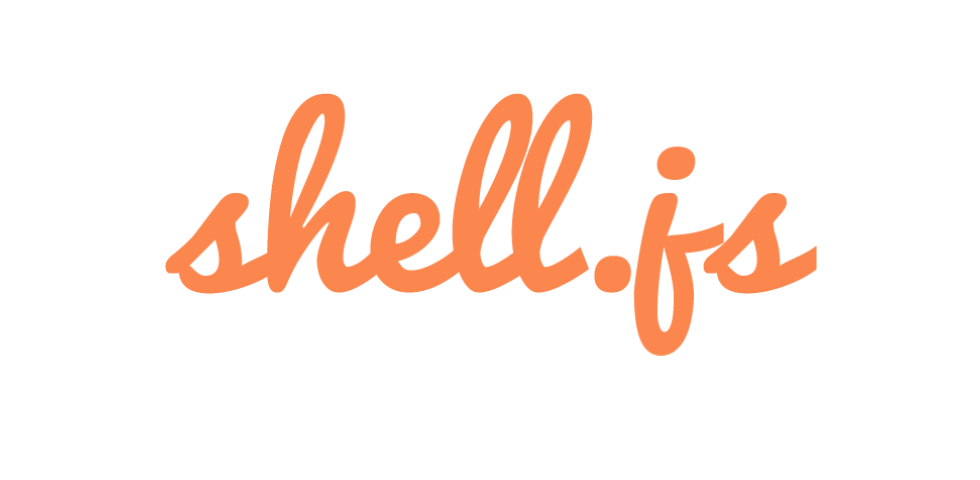

> A **JavaScript** library to create HTML **terminals** in web pages.

[](https://www.npmjs.com/package/shell.js)
[](https://www.npmjs.com/package/shell.js)
[](https://snyk.io/test/github/davidecaruso/shell.js)
[](https://travis-ci.org/davidecaruso/shell.js)
[](https://coveralls.io/github/davidecaruso/shell.js?branch=master)


## Install
```bash
$ yarn add shell.js # recommended
$ npm i shell.js
$ bower install shell.js --save
```

## Options
For each **Shell** instance you can set the following options:

| Options | Allowed values | Description | Defaut value |
| ------- | -------------- | ----------- | ------------ |
| user | *string* | The user | **"user"** |
| host | *string* | The host | **"host"** |
| path | *string* | The working directory | **"~"** &#124; **"C:\Windows\system32\"** |
| style | **"default"**&#124;**"ubuntu"**&#124;**"osx"**&#124;**"windows"** | The OS style | **"default"** |
| theme | **"dark"**&#124;**"light"** | The theme | **"dark"** |
| responsive | *boolean* | Responsiveness  | *true* |
| typed | *Typed* callable | **[Typed.js](https://github.com/mattboldt/typed.js/)** integration to make shell alive | *null* |
| commands | array | The commands list | *[]* |


## Usage
Create a HTML element with a specified ID... 
```html
<div id="awesome-shell"></div>
```
...and pass the CSS selector to the **Shell.js** constructor:
```javascript
document.addEventListener('DOMContentLoaded', function() {
    let shell = new Shell('#awesome-shell', {
        user: 'foobar',
        host: 'MacMini',
        path: '/etc/',
        style: 'osx',
        theme: 'dark',
        responsive: false,
        commands: ['First command', 'Second command', '...']
    });
});
```

> Visit the documentation [page](https://davidecaruso.github.io/shell.js)

## Author
[Davide Caruso](https://davidecaruso.github.io)

## License
Licensed under [MIT](LICENSE).
